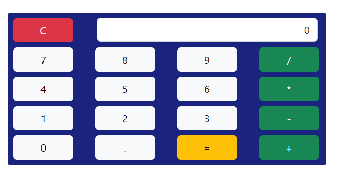

# Calculadora-React

## Projeto criado no Curso React Hooks 

Calculadora Simples em React , com operadores númericos (*, / , + , - ).

Este projeto consiste em implementar :
 - ```Hook ```  - ```UseState```;
 - ```Bootstrap```;
 - ``` Testes  unitário```.


 ## O Style feito com Bootstrap, tecnologia em aprendizagem no momento;
 


## Tag utilizadas BootStrap : 
  - ```Container``` ,  para  estrutura;
  - ```Row``` ,para criar linhas;
  - ```Col``` , para criar colunas;
  - ```Button``` , para criar botões. ```variant``` define tipo,cor  do botão;
  - ```Form.Control```, para criar Input onde receberá números;

## Teste Unitário

### O arquivo ```Calculadora.service.js``` , contém a função de cálculo dos operadores númericos ,  onde retorna um Array com as funções:
 -  ```calcular```  que  receberá 3 parâmetros , (num1,num2, operador);
 - ```concatenarNum``` contém casos para concatenar números ( '0' , '.' , '-1' )
 - ```Operadores``` (SOMA, MULTIPLICAR, SUBTRACAO, DIVISAO)

## Testes  para verificar antes o uso da calculadora.

### O arquivo ```Calculadora.service.test.js``` contém os testes. 

 A função  ```CalculadoraService``` importada  do arquivo ```Calculadora.service.js``` , é chamada aqui realizar os testes.
 - CASO 1  "SOMA" ; 
 - CASO 3  "SUBTRACAO" ; 
 - CASO 2  "DIVISAO" ; 
 - CASO 3  "MULTIPLICAR" ; 
 - CASO 5  "OPERAÇÕES INVALIDAS" ; . 


